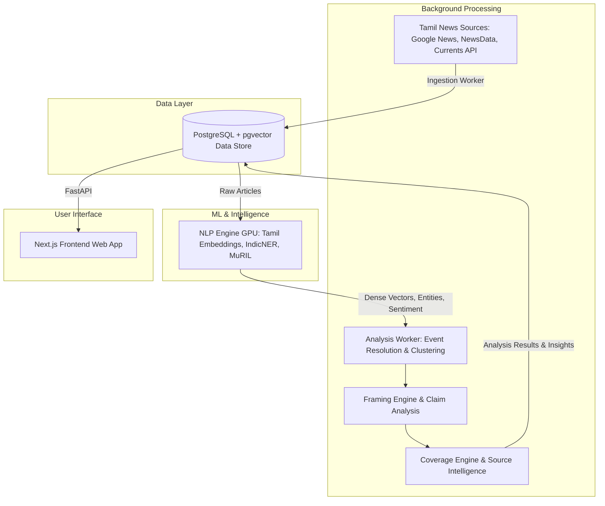

<div align="center">
  <h1>PerspectiveLens</h1>
  <p><b>An event-centric Tamil news intelligence architecture for multi-source semantic aggregation, media-framing comparison, and coverage-blindspot detection.</b></p>
  
  [](https://python.org)
  [](https://fastapi.tiangolo.com)
  [](https://nextjs.org/)
  [](https://postgresql.org)
  [](https://redis.io)
  [](https://www.docker.com/)
</div>

<br />

## Overview

**PerspectiveLens** is a text analytics platform developed as a semester project for the Text Analytics subject, guided by Ayshwarya Kurup. Inspired by platforms like "Ground News," PerspectiveLens is designed specifically for the **Tamil Nadu media landscape**. 

Our perspectives are shaped by the news we consume. Media outlets can manipulate narratives through false accusations, exaggeration, or suppression of facts. PerspectiveLens brings transparency by computationally detecting differences in media framing, factual agreements/disagreements, and coverage blindspots.

**It does not determine which publisher is right or wrong, nor does it rewrite news.** It groups articles by *events* rather than *publishers*, allowing readers to compare facts side-by-side.

---

## Core Features

* **Event-Centric Aggregation:** Groups articles by real-world events before performing any political or bias comparison.
* **Multi-Source Ingestion:** Automatically ingests from Tamil news sources using APIs like Google News, NewsData.io, and Currents.
* **Advanced NLP Pipeline:** Uses state-of-the-art Tamil models (fastText, IndicNER, MuRIL, IndicBERT) for sentence embeddings, entity extraction, stance, and sentiment classification.
* **Media Framing Comparison:** Detects loaded lexical choices, emotional language, and specific framing types across different publishers.
* **Blindspot Detection:** Identifies which events, entities, or aspects are ignored by specific political or editorial cohorts (e.g., Dravidian-oriented vs. Conservative).
* **Claim Analysis:** Tracks where reports agree and where they conflict on specific factual claims.
* **Comparison Dashboard:** A bilingual UI that presents the timeline, reporting differences, and publisher comparison without altering the original articles.

---

## System Architecture Flowchart

The entire system is decoupled into isolated, scalable Docker microservices:



### Microservices Setup (docker-compose.yml)

The platform orchestrates 7 core containers:

1. **postgres**: Source of truth with pgvector for semantic similarity search.
2. **redis**: Message broker for Celery queues and short-lived query cache.
3. **ingestion-worker**: FastAPI + Celery worker handling rate limits, API fetching, and deduplication.
4. **nlp-engine**: Heavy PyTorch/GPU processing unit (Embeddings, Stance, Framing).
5. **analysis-worker**: Mathematical engine for clustering, claim analysis, and blindspot calculations.
6. **api**: Public-facing FastAPI backend REST API.
7. **frontend**: React/Next.js frontend.

---

## Technology Stack

### Backend & APIs
* **Framework:** Python, FastAPI
* **Task Queues:** Celery
* **Database:** PostgreSQL (with pgvector & JSONB), Redis

### NLP & Text Analytics Engine
* **Language Validation:** fastText lid.176
* **Sentence Embeddings:** l3cube-pune/tamil-sentence-similarity-sbert
* **Entity Extraction:** ai4bharat/IndicNER
* **Stance & Framing:** Fine-tuned google/muril-base-cased & IndicBERTv2
* **Summarization:** mT5_multilingual_XLSum

### Frontend Interface
* **Framework:** React, Next.js
* **Styling:** Tailwind CSS

---

## Getting Started

### Prerequisites

* Docker and Docker Compose
* GPU with CUDA support (Recommended for nlp-engine)
* Node.js v20+ (for local frontend development)

### Running Locally

1. **Clone the repository**
   ```bash
   git clone https://github.com/your-username/perspective_lens.git
   cd perspective_lens
   ```

2. **Environment Setup**
   Copy the example environment file and fill in your API keys (NewsData.io, Currents, etc.):
   ```bash
   cp .env.example .env
   ```

3. **Start the Platform**
   Spin up the entire microservices stack using Docker Compose:
   ```bash
   docker compose up --build
   ```

4. **Access the Application**
   * **Frontend:** http://localhost:3000
   * **API Docs:** http://localhost:8000/docs
   * **NLP Engine:** http://localhost:8001/docs

---

## Project Flow & NLP Pipeline

1. **Ingest & Normalize:** Fetch articles from diverse sources, validate language, normalize Unicode (NFC), and aggressively deduplicate.
2. **Embed & Extract:** Generate sentence/lead embeddings using SBERT and extract Named Entities (IndicNER).
3. **Resolve Events:** Query pgvector using cosine similarity to group new articles into existing real-world events.
4. **Analyze Framing & Claims:** Use MuRIL to extract emotional sentiment, framing styles, and identify contradicting claims between outlets.
5. **Detect Blindspots:** Identify specific entities or aspects that are systematically excluded by publisher cohorts.
6. **Serve Insights:** Make everything queryable via FastAPI and rendered on the Next.js dashboard.

---

## Limitations & Future Work

* **Limitations:** The system only analyzes publicly available news text and cannot independently verify real-world facts. It does not rewrite original content.
* **Future Work:**
  * Real-time streaming ingestion.
  * Expansion to multi-lingual (English + Tamil cross-comparison).
  * Historical event tracking and analysis.
  * Deeper Source Reliability Metadata.

---

<div align="center">
  <p>Built for a more transparent media landscape.</p>
</div>
